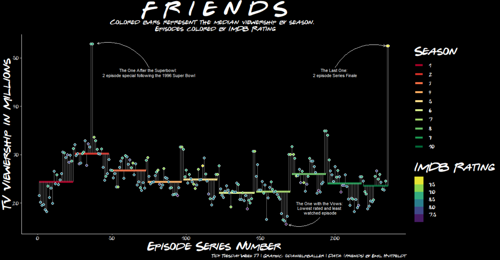
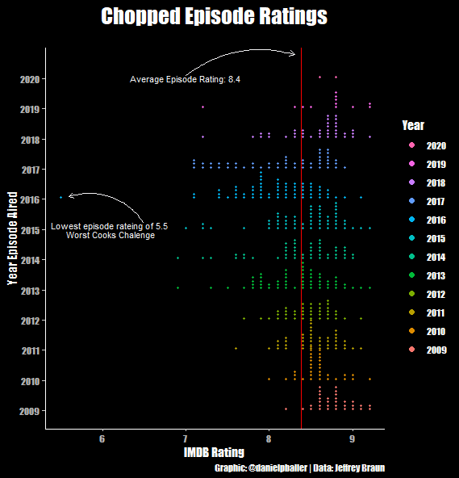
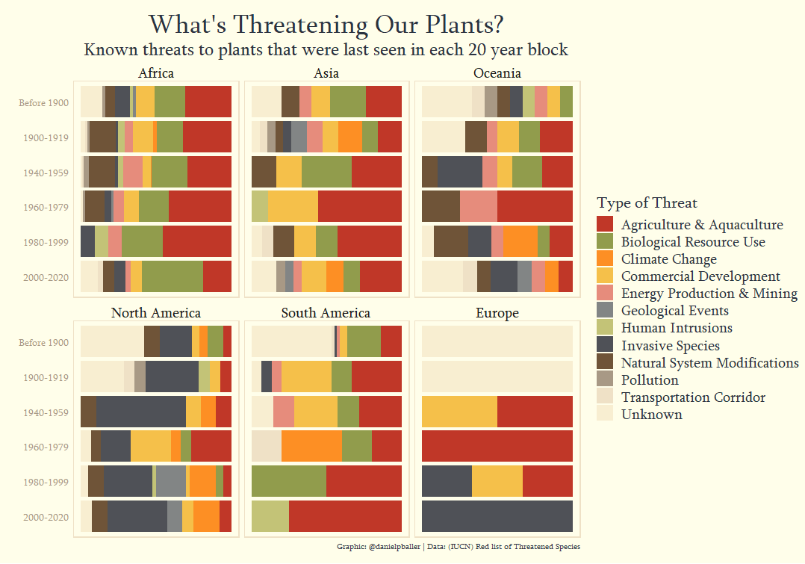
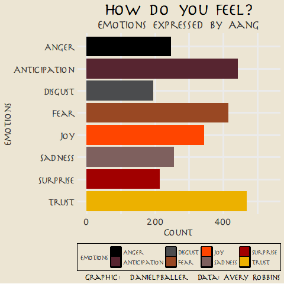
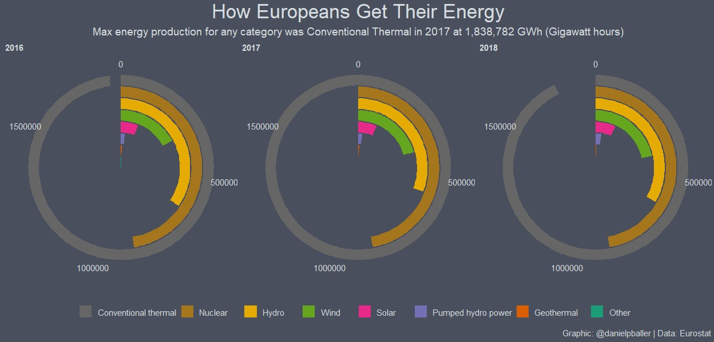
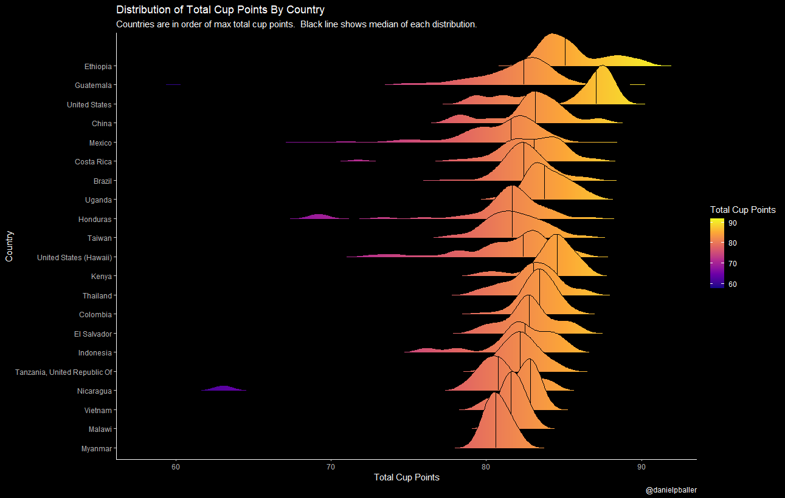
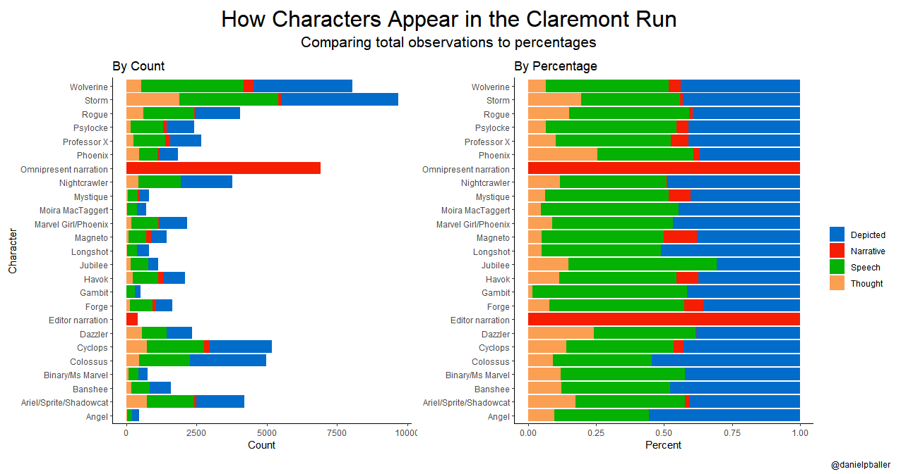
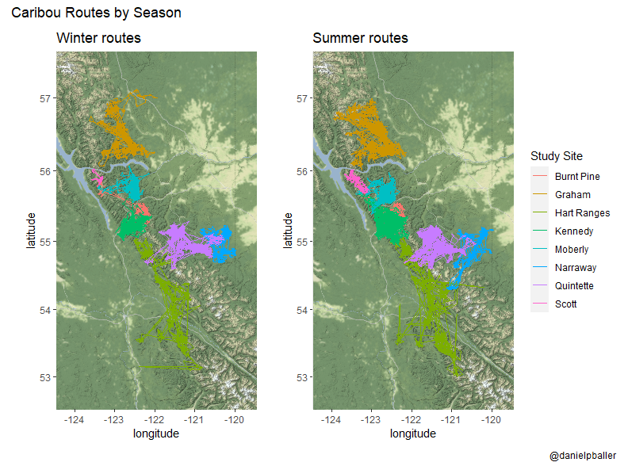

# Tidy_Tuesday
Tidy Tuesday Plots and Code (Click on a plot to see the code)

## Week 37 Friends

## Week 36 Global Crop Yields

## Week 35 Chopped

## Week 34 Extinct Plants

## Week 33 Avatar: The Last Airbender
Top 82 characters with at least 10 pieces of dialogue.

Top 10 characters with at least 100 pieces of dialogue.

## Week 32 European Energy 

## Week 29 Astronauts

## Week 28 Coffee Ratings

## Week 27 Claremont Run X-men

## Week 26 Caribou

